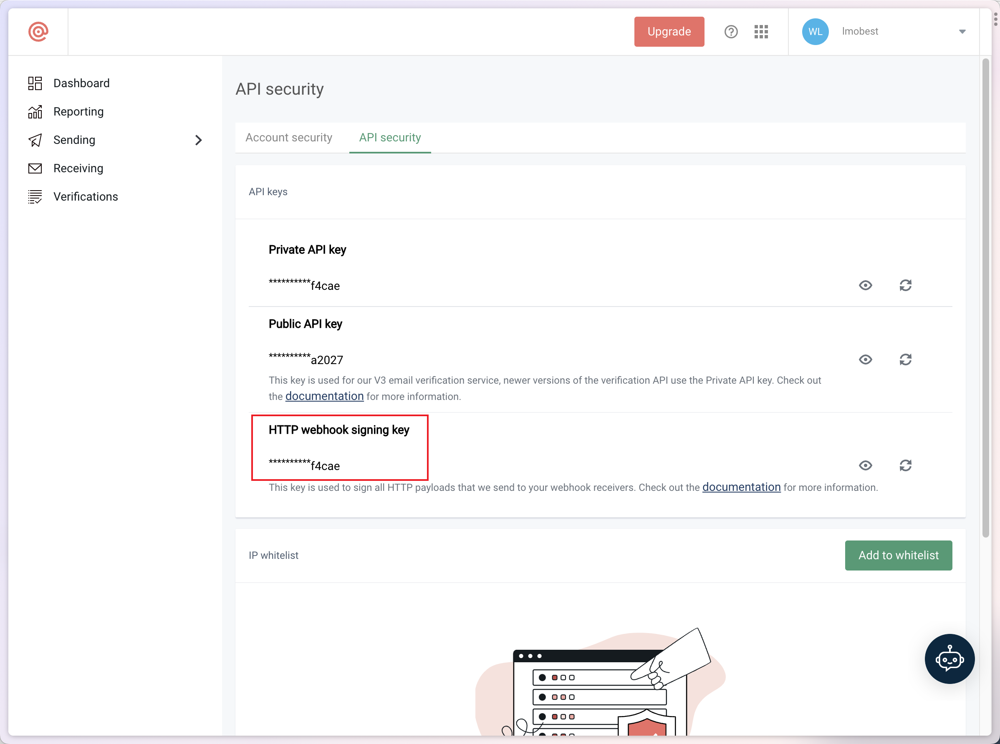
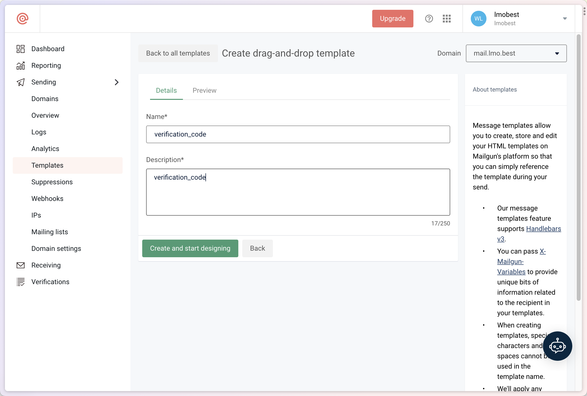
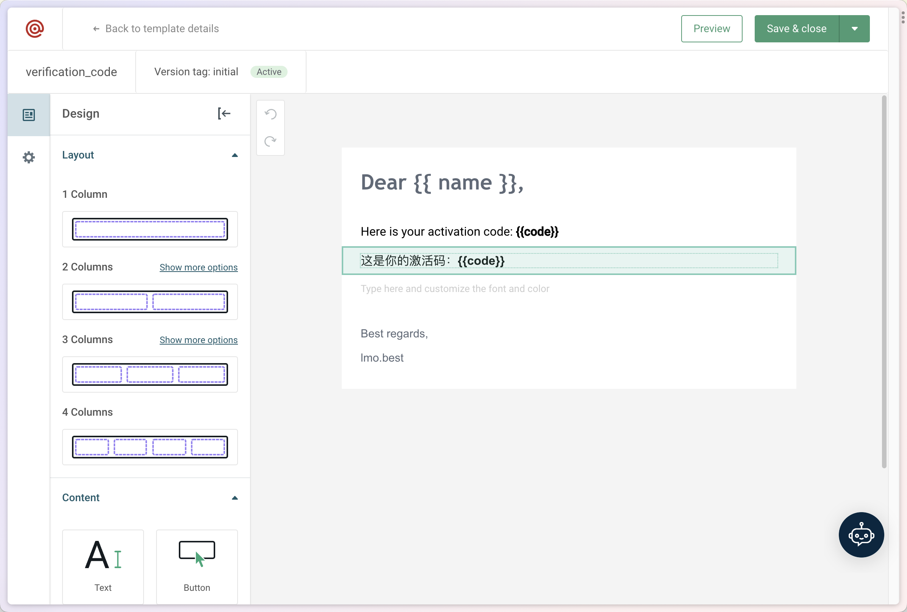

# 配置邮件服务器

目前我们接入了第三方发件服务，需要自行注册后获取相关的 `id` 和 `secret`，并填入环境变量。

## 通用环境变量

| 环境变量的名称(NAME) | 环境变量的内容(KEY)          | 备注                |
|---------------|-----------------------|-------------------|
| EMAIL_SERVICE | `elastice`或者`mailgun` | 留空或不填写改变量则不启用邮箱验证 |

## Mailgun

### 注册 mailgun 并获取以下变量

API_KEY 可在账户中如下图位置找到：

| 环境变量的名称(NAME)        | 环境变量的内容(KEY)        | 备注                             |
|----------------------|---------------------|--------------------------------|
| EMAIL_SERVICE        | `mailgun`           | 选择 `mailgun` 发件服务              |
| MAILGUN_EMAIL_DOMAIN | mailgun 要使用的邮箱域名    | 必填，邮箱域名 eg: `mail.example.com` |
| MAILGUN_API_KEY      | mailgun 账户的 API KEY | 必填                             |

### 新建邮件模版

选中模板样式：

确保 Name 填入 `verification_code` 无误

自行配置模版样式，确保在页面中通过花括号设置`name`和`code`变量，如图所示。

保存模版。

## Elastice Mail

### 注册并验证域名/邮箱

| 环境变量的名称(NAME)          | 环境变量的内容(KEY)         | 备注                                      |
|------------------------|----------------------|-----------------------------------------|
| EMAIL_SERVICE          | `elastice`           | 选择 `elastice` 发件服务                      |
| ELASTICE_EMAIL_SENDER  | elastice 要使用的发件人邮箱地址 | 必填，邮箱域名 eg: `no-reply@mail.example.com` |
| ELASTICE_EMAIL_API_KEY | elastice 账户的 API KEY | 必填                                      |

